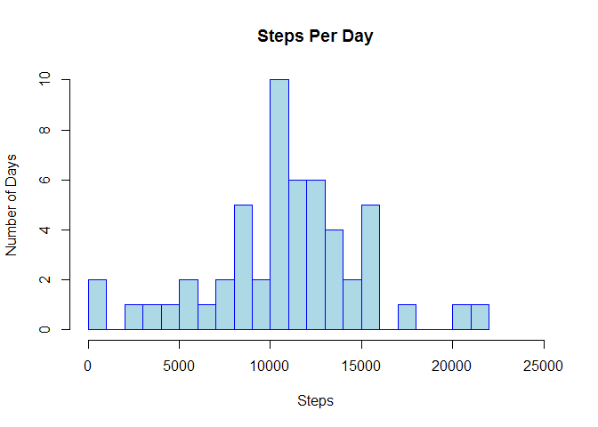

# Exploring Some Activity Monitoring Data
Jesse Harris  
March 11, 2017  


## Loading and preprocessing the data

Assuming that the activity.csv file exists within the working directory, we can
load the data as follows.


```r
activity <- read.csv("activity.csv")
```

What does the data looks like?


```r
str(activity)
```

```
## 'data.frame':	17568 obs. of  3 variables:
##  $ steps   : int  NA NA NA NA NA NA NA NA NA NA ...
##  $ date    : Factor w/ 61 levels "2012-10-01","2012-10-02",..: 1 1 1 1 1 1 1 1 1 1 ...
##  $ interval: int  0 5 10 15 20 25 30 35 40 45 ...
```

Let's convert the dates from factor to date class.


```r
activity$date <- as.Date(activity$date, format = "%Y-%m-%d")
```

Okay, our data should be ready for analysis.


```r
str(activity)
```

```
## 'data.frame':	17568 obs. of  3 variables:
##  $ steps   : int  NA NA NA NA NA NA NA NA NA NA ...
##  $ date    : Date, format: "2012-10-01" "2012-10-01" ...
##  $ interval: int  0 5 10 15 20 25 30 35 40 45 ...
```

Looks good. There are some NAs, but we'll ignore them for now.

## What is the mean total number of steps taken per day?

First, let's calculate the total number of steps taken each day.


```r
df1 <- aggregate(steps ~ date, data = activity, sum)
head(df1)
```

```
##         date steps
## 1 2012-10-02   126
## 2 2012-10-03 11352
## 3 2012-10-04 12116
## 4 2012-10-05 13294
## 5 2012-10-06 15420
## 6 2012-10-07 11015
```

Next, let's plot this as a histogram to get a feel for the distribution of the
data.


```r
hist(df1$steps,
     main = "Steps Per Day",
     xlab = "Steps",
     ylab = "Number of Days",
     border = "blue",
     col = "lightblue",
     xlim = c(0,25000),
     breaks = 24)
```

<!-- -->

Based on the histogram, it looks like the most common total per day step count
is between 10,000 and 11,000. Let's see what the mean and median values work out
to exactly.


```r
mean(df1$steps)
```

```
## [1] 10766.19
```

```r
median(df1$steps)
```

```
## [1] 10765
```

## What is the average daily activity pattern?

First, let's figure out the average number of steps taken for each time
interval across all days.


```r
df2 <- aggregate(steps ~ interval, data = activity, mean)
```

To make sure this worked, let's look at a section of the data, specifically, the
average values for 7-8 AM.


```r
df2[85:97,]
```

```
##    interval    steps
## 85      700 43.81132
## 86      705 44.37736
## 87      710 50.50943
## 88      715 54.50943
## 89      720 49.92453
## 90      725 50.98113
## 91      730 55.67925
## 92      735 44.32075
## 93      740 52.26415
## 94      745 69.54717
## 95      750 57.84906
## 96      755 56.15094
## 97      800 73.37736
```

It seems to look okay. Let's try making this data into a time series plot using
ggplot2.


```r
library(ggplot2)
p2 <- ggplot(df2, aes(interval, steps)) +
        geom_line()
print(p2)
```

<!-- -->

So which 5-minute interval contains, on average, the maximum number of steps?


```r
head(df2[order(df2$steps,decreasing=T),])
```

```
##     interval    steps
## 104      835 206.1698
## 105      840 195.9245
## 107      850 183.3962
## 106      845 179.5660
## 103      830 177.3019
## 101      820 171.1509
```

Looks like it's the 835 interval, which seems to match what we saw in our time
series plot above.

## Imputing missing values

How many of the rows in the dataset contain NA values?


```r
totalna <- sum(!(complete.cases(activity)))
totalna
```

```
## [1] 2304
```

So 2304 rows. For interest's sake, let's check what percentage of the
values that represents.


```r
totalna/nrow(activity)*100
```

```
## [1] 13.11475
```

13.1 percent. Let's impute the missing values to see if that will substantially
change the results of previous analyses. The method we'll use is to replace NA
values with the mean value, across all days, for that same time interval. The
mean value will be taken from the df2 data frame, created earlier, which
contains all the intervals and the mean steps value for each.


```r
activity2 <- activity
activity2$steps[is.na(activity2$steps)] <- df2$steps[match(activity2$interval,
                                                         df2$interval)]
```

```
## Warning in activity2$steps[is.na(activity2$steps)] <-
## df2$steps[match(activity2$interval, : number of items to replace is not a
## multiple of replacement length
```

Despite the warning, the code accomplished what it needed to do. Earlier when we
ran str against the activity data frame, the first steps values were all NAs.
Let's check now.


```r
str(activity2)
```

```
## 'data.frame':	17568 obs. of  3 variables:
##  $ steps   : num  1.717 0.3396 0.1321 0.1509 0.0755 ...
##  $ date    : Date, format: "2012-10-01" "2012-10-01" ...
##  $ interval: int  0 5 10 15 20 25 30 35 40 45 ...
```

It seems the replacement of NA values worked. Let's double-check to make sure
there are no NAs left in the data set.


```r
sum(!(complete.cases(activity2)))
```

```
## [1] 0
```

Good, none left. Now we'll generate our histogram again and see if there is any
difference. First we'll again calculate the total number of steps each day.


```r
df3 <- aggregate(steps ~ date, data = activity2, sum)
```

Now let's re-generate our original histogram and plot the new data as a second
histogram for comparison.


```r
par(mfrow=c(1,2))

# Histogram based on original data

hist1 <- hist(df1$steps,
     main = "Steps Per Day with NAs",
     xlab = "Steps",
     ylab = "Number of Days",
     border = "blue",
     col = "lightblue",
     xlim = c(0,25000),
     ylim = c(0,20),
     breaks = 24)

# Histogram based on dataset with imputed data

hist(df3$steps,
     main = "Steps Per Day with Imputed Data",
     xlab = "Steps",
     ylab = "Number of Days",
     border = "blue",
     col = "lightblue",
     xlim = c(0,25000),
     ylim = c(0,20),
     breaks = 24)
```

<!-- -->

So not much changed, except the number of days with 10000-11000 steps has
increased significantly. Why is that?

Well let's look at the  mean and median values. Here is a comparison of the mean
and median for the dataset including NAs, and our new dataset with imputed data.


```r
a <- mean(df1$steps)
b <- median(df1$steps)
c <- mean(df3$steps)
d <- median(df3$steps)
df4 <- data.frame(c(a,b), c(c,d))
rownames(df4) <- c("mean", "median")
colnames(df4) <- c("Includes.NAs", "Imputed.Data")
df4
```

```
##        Includes.NAs Imputed.Data
## mean       10766.19     10766.19
## median     10765.00     10766.19
```

Wait, how come the mean and median ended up the same when we used imputed data?
Well, the original data had eight days with no observations. Every interval for
those days was filled with the same imputed data, that is, the mean for each
interval, and therefore all those days ended up having the same total number of
steps--10766.19 steps, to be exact.

This also explains why the number of days with step counts between 10,000
and 11,000 increased signifantly in our new histogram.

## Are there differences in activity patterns between weekdays and weekends?

Let's create a new factor variable that identifies whether a particular
observation occurred on a weekday or weekend.


```r
activity2$day <- weekdays(activity2$date)
activity2$day <- gsub("S(atur|un)day", "weekend", activity2$day)
activity2$day <- gsub("(Mon|Tues|Wednes|Thurs|Fri)day", "weekday",
                      activity2$day)
```

Now let's aggregate this data to get the average steps per interval on weekdays
and weekends.


```r
df5 <- aggregate(steps ~ interval + day, data = activity2, mean)
```

Finally, we'll visualize this data using a time series plot.


```r
p4 <- ggplot(df5, aes(interval, steps)) +
        geom_line()
p4 + facet_grid(day ~ .)
```

<!-- -->

So a couple interesting differences are apparent. As might be expected, there
seems to be less activity in the early morning on weekends. Also, from
mid-morning to afternoon, the subject appears to be more active on weekends than
on weekdays.
